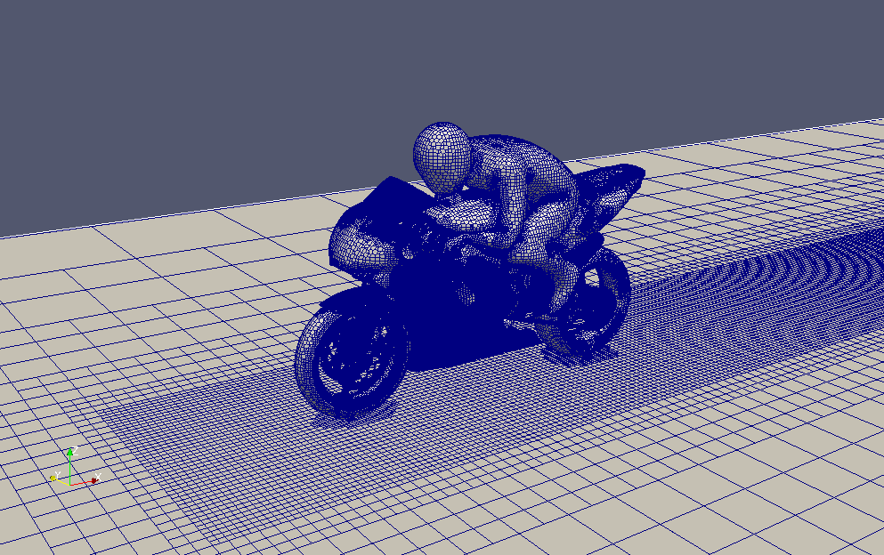

Your current `README.md` is incredibly well-written—it's sharp, technically precise, and maps out your benchmarking goals perfectly.

To give it that exact **OpenFOAM HPC Committee vibe**, we need to restructure it to mirror how official HPC benchmarks are presented. They typically treat the repository as a reproducible toolkit, standardizing grid sizes (e.g., Small, Medium, Large) so that performance scaling behaves predictably across different core counts and memory architectures.

Including results directly in the main `README.md` is standard for HPC benchmarks, as it serves as the primary visual hook. I have restructured your README below to include a dedicated **Performance Results & Scaling Analysis** section with placeholder markdown tables and a layout for your scaling plots.

Here is the revised `README.md` prepared for your 400k, 800k, and 1.6M cell grid study, complete with proper attribution to the HPC Committee.

---

```markdown
# Linear Solver Benchmarking: petscFoam vs. Native OpenFOAM


> ⚠️ **WORK IN PROGRESS:** This repository is currently under active development.

This repository provides an automated benchmarking suite comparing native OpenFOAM linear solvers against the **PETSc library (`petscFoam`)** framework via dynamic runtime binding. Running locally, this study evaluates solver convergence rates, wall-clock execution speedups, and memory footprint scaling across varied mesh resolutions.

The test cases, automated mesh generation workflows, and scaling methodologies are inspired by and adapted from the official **OpenFOAM Foundation / ESI HPC Committee Motorbike Benchmark**. 
* **Reference Baseline:** [OpenFOAM HPC Committee Motorbike Benchmark](https://develop.openfoam.com/committees/hpc/-/tree/master/incompressible/simpleFoam/HPC_motorbike)

For step-by-step instructions on compiling and linking the external solver binaries locally without altering core system paths, see the accompanying [PETSc & petscFoam Installation Guide](Install_guide_petscFoam.md).

---

## 📊 Benchmark Test Matrix

To rigorously test linear solver scalability, the baseline 3D External Aerodynamics Motorbike case (`simpleFoam`) has been discretized into three distinct grid levels. This allows us to observe how the PETSc interface handles increased memory bandwidth demands and matrix translation overhead as problem size scales.

| Grid Tier | Target Cell Count | Mesh Strategy Modifications (`blockMesh` / `snappyHexMesh`) | Purpose |
| :--- | :--- | :--- | :--- |
| **Small** | ~400,000 cells | Baseline HPC Committee resolution profile | Rapid prototyping, baseline stability, & low-core scaling. |
| **Medium** | ~800,000 cells | 1x level of localized refinement in wake region | Stress-testing AMG preconditioning clustering logic. |
| **Large** | ~1,600,000 cells | Globally doubled cell density across background block | High-load memory bandwidth & cache allocation scaling. |

### Solver Configurations Evaluated

1. **Baseline (FOAM-GAMG-PCG):** Native OpenFOAM configuration. Uses a Conjugate Gradient (PCG) solver accelerated by a Geometric-Algebraic Multigrid (GAMG) preconditioner for the pressure matrix, coupled with a standard PBiCGStab solver for momentum.
2. **PETSc Hypre (PETSC-AMG-CG):** Interface configuration routing the pressure system to PETSc. Employs a Conjugate Gradient (CG) solver preconditioned via Hypre's classic algebraic multigrid wrapper (`boomeramg`), evaluating the matrix transformation over Compressed Sparse Row (CSR) storage.
3. **PETSc Hypre + Caching (PETSC-AMG-CG + Caching):** Peak optimization run using identical linear algebra solver blocks as Config 2, but utilizing the `petscCacheManager` engine to lock down preconditioner coefficients inside system RAM. This bypasses the structural assembly phase, skipping the translation overhead for convergent flow regimes.

---

## 💻 Environment & Hardware Profile
* **OS:** Ubuntu via WSL2
* **Hardware:** AMD Ryzen 7 5700U with Radeon Graphics | 16GB RAM
* **Software:** OpenFOAM-v2312+ 
* **PETSc Integration:** Dynamic runtime binding via the `external-solver` module (`petscFoam.so` compiled with `-prefix=user` against PETSc release branch)

---

## 🚀 How to Run the Benchmark

The repository includes shell scripts to automate mesh generation, case decomposition, execution, and log parsing.

1. **Select Grid Size:** Navigate to the desired case size directory:
   ```bash
   cd cases/motorbike_small

```

2. **Generate Mesh & Run:** Run the automated execution pipeline (ensure `petscFoam.so` is in your `LD_LIBRARY_PATH`):
```bash
./Allrun

```


3. **Parse Metrics:** Extract scaling data from log files into clean CSVs using the post-processing script:
```bash
python3 scripts/parse_foam_logs.py

```


---

## 📈 Performance Results & Scaling Analysis

The performance metrics focus strictly on core computational efficiency, breaking down the costs associated with matrix assembly, preconditioner setups, and pure linear solver iterations.

### 1. Execution Speed & Throughput
*(Placeholder)*

* **ClockTime per Iteration:** Real-world seconds elapsed per SIMPLE loop.
* **Execution Speedup:** Relative performance multiplier normalized against the native `FOAM-GAMG-PCG` baseline.

| Grid Tier | Solver Configuration | Avg. Execution Time / Iteration (s) | Relative Speedup Factor |
| --- | --- | --- | --- |
| **Small (~400k)** | FOAM-GAMG-PCG | *[0.00]* | *1.00 (Baseline)* |
|  | PETSC-AMG-CG | *[0.00]* | *[0.00x]* |
|  | PETSC-AMG-CG + Caching | *[0.00]* | *[0.00x]* |
| **Medium (~800k)** | FOAM-GAMG-PCG | *[0.00]* | *1.00 (Baseline)* |
|  | PETSC-AMG-CG | *[0.00]* | *[0.00x]* |
|  | PETSC-AMG-CG + Caching | *[0.00]* | *[0.00x]* |
| **Large (~1.6M)** | FOAM-GAMG-PCG | *[0.00]* | *1.00 (Baseline)* |
|  | PETSC-AMG-CG | *[0.00]* | *[0.00x]* |
|  | PETSC-AMG-CG + Caching | *[0.00]* | *[0.00x]* |

### 2. Numerical Convergence Profile
*(Placeholder)*

* **Residual Convergence Rate:** Number of iterations required to hit the strict $10^{-6}$ target.

| Grid Tier | Solver Configuration | Pressure Iterations to Convergence | Avg. PCSetUp Time / Iteration (s) |
| --- | --- | --- | --- |
| **Small (~400k)** | FOAM-GAMG-PCG | *[00]* | *N/A* |
|  | PETSC-AMG-CG | *[00]* | *[0.00]* |
|  | PETSC-AMG-CG + Caching | *[00]* | *[0.00] (Should approach 0)* |
| **Medium (~800k)** | FOAM-GAMG-PCG | *[00]* | *N/A* |
|  | PETSC-AMG-CG | *[00]* | *[0.00]* |
|  | PETSC-AMG-CG + Caching | *[00]* | *[0.00]* |
| **Large (~1.6M)** | FOAM-GAMG-PCG | *[00]* | *N/A* |
|  | PETSC-AMG-CG | *[00]* | *[0.00]* |
|  | PETSC-AMG-CG + Caching | *[00]* | *[0.00]* |

### 3. Memory & Hardware Footprint

* **Peak Memory Footprint:** Volumetric RAM usage difference between solver libraries, mapping the penalty of holding double-precision sparse matrix mappings in external library formats.


*(Placeholder)*

---

## 📜 Attribution & License

The mesh topologies, background geometry, and underlying solver parameters utilized in this project are derivative works based on the **HPC Motorbike Benchmark Case** developed by the **OpenFOAM Foundation / ESI HPC Committee**.

This benchmarking harness is distributed under the GNU General Public License (GPLv3) to align with OpenFOAM software standards.

```

```